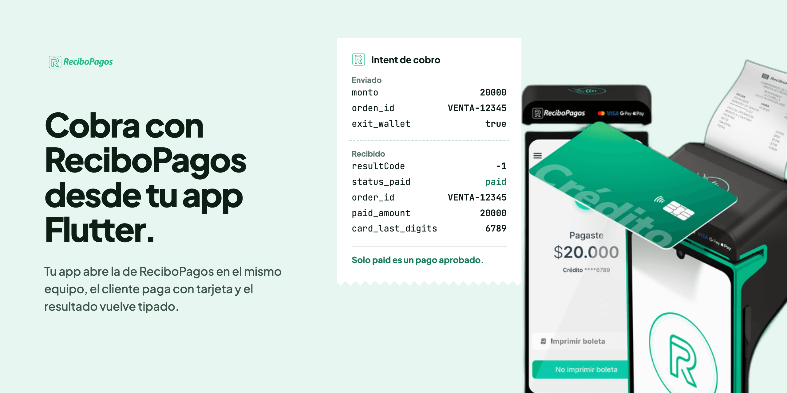
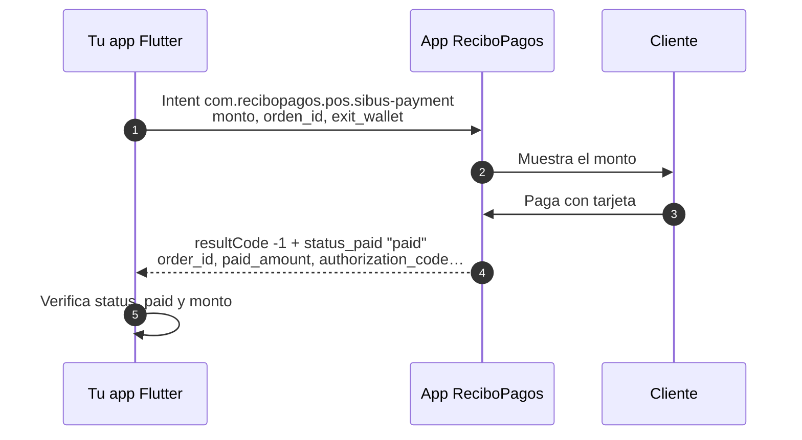

<picture>
  <source media="(prefers-color-scheme: dark)" srcset="doc/assets/hero-dark.png">
  
</picture>

# recibopagos_app2app

Plugin Flutter para Android que cobra con la app **ReciboPagos POS** instalada
en el mismo equipo. Tu app le pasa el monto por un Intent, el cliente paga con
tarjeta en la pantalla de ReciboPagos y el resultado vuelve a tu app como un
objeto tipado. No hay red de por medio.

Implementa la [integración App To App de ReciboPagos](https://recibopagos.com/desarrolladores/app-to-app).

<sub>Paquete mantenido por Mufin. No es un producto oficial de ReciboPagos;
el nombre, el logo y las imágenes del equipo pertenecen a ReciboPagos.</sub>

## Antes de empezar

- La app `com.recibopagos.pos` instalada en el equipo.
- El equipo en **modo intent**. Se activa desde el panel de ReciboPagos. Sin
  él, la app rechaza el cobro y responde como cancelado.
- Nada que agregar al `AndroidManifest.xml` de tu app: el plugin ya declara la
  visibilidad del package que exige Android 11+.

## Instalación

```yaml
dependencies:
  recibopagos_app2app:
    git:
      url: https://github.com/morello-cl/recibopagos_app2app.git
      ref: v0.1.2
```

## Cobrar

```dart
import 'package:recibopagos_app2app/recibopagos_app2app.dart';

final rp = RecibopagosClient(channel: 'DTEx');

if (!await rp.isInstalled()) {
  // Ofrece otro medio de pago.
}

try {
  final pago = await rp.charge(const RecibopagosChargeRequest(
    amount: 20000,          // pesos enteros, mayor a 0
    orderId: 'VENTA-12345', // envíalo siempre: con él concilias
  ));

  final venta = pago.paidAmount - pago.gratuity; // paidAmount incluye propina
  // Recién aquí emites la boleta.
  // pago.orderId es un id de ReciboPagos (uuid v7), no tu orderId.
} on RecibopagosException catch (e) {
  // Ver la tabla de abajo.
}
```

> [!WARNING]
> **`RESULT_OK` no significa que se pagó.** Solo indica que el flujo terminó.
> El veredicto está en `status_paid`: un pago se aprueba solo con
> `RESULT_OK` **y** `status_paid == "paid"`. `charge()` también verifica el
> monto; si retorna, se cobró. En cualquier otro caso lanza una excepción.

### Cómo viaja un cobro



### Opciones del cobro

| Parámetro       | Qué hace                                                        | Por defecto |
|-----------------|-----------------------------------------------------------------|-------------|
| `amount`        | Monto en pesos enteros. Obligatorio y mayor a 0.                | —           |
| `orderId`       | Tu id de orden. ReciboPagos no lo devuelve (ver abajo).         | —           |
| `paymentType`   | Sugiere crédito o débito al cajero.                             | lo elige el cajero |
| `exempt`        | Marca la venta como exenta de IVA.                              | `false`     |
| `skipKeypad`    | Salta la calculadora y va directo al pago.                      | `true`      |
| `transactionId` | Id de transacción de tu sistema.                                | —           |

### Qué devuelve un pago aprobado

`orderId`, `transactionId`, `authorizationCode`, `cardLastDigits`,
`paymentMethod` (crudo: el equipo envía `CREDIT`; usa `paymentType`, que
normaliza `CREDIT`/`CREDITO`/`DEBIT`/`DEBITO`), `installments` (0 = contado),
`gratuity` (propina), `paidAmount` (total con propina) y `terminalSerial`.
Los extras originales quedan en `raw` para logs y soporte.

## Cuando no se cobra

Cada desenlace tiene su propia excepción. Todas heredan de
`RecibopagosException`.

| Excepción                          | Cuándo ocurre                                      | Qué hacer |
|------------------------------------|----------------------------------------------------|-----------|
| `RecibopagosCancelledException`    | El cajero canceló, o el equipo no está en modo intent | Volver a la venta. Si se repite, revisar el modo intent en el panel. |
| `RecibopagosRejectedException`     | El emisor rechazó la tarjeta                       | Pedir otra tarjeta u otro medio de pago. |
| `RecibopagosTimeoutException`      | El cobro caducó (expira a los 5 minutos)           | Lanzar un cobro nuevo. |
| `RecibopagosFailedException`       | La app ReciboPagos falló                           | Reintentar; si persiste, soporte de ReciboPagos. |
| `RecibopagosNotInstalledException` | La app no está en el equipo                        | Ofrecer otro medio de pago. |
| `RecibopagosUnknownException`      | Estado incierto o monto que no cuadra              | **No asumir que no se cobró.** Conciliar antes de reintentar. |

## Conciliar un cobro interrumpido

Si Android cierra tu app mientras el cliente paga, el resultado no llega.
ReciboPagos guarda el último cobro y lo expone para consulta:

```dart
final ultimo = await rp.lastCharge();

// Ojo: ReciboPagos no hace eco de tu orderId, así que ultimo.orderId no
// identifica la venta pendiente: isPaid puede ser de un cobro anterior.
// Confírmalo en el panel de ReciboPagos. Pendiente de validar en terminal.
if (ultimo != null && ultimo.isPaid) {
  // Posible cobro: no vuelvas a cobrar sin confirmarlo.
}
```

Llámalo al volver a primer plano si tienes una venta pendiente.

## Probar sin terminal

```dart
final rp = RecibopagosClient(
  mode: RecibopagosMode.mock,
  mockOutcome: RecibopagosMockOutcome.rejected,
);
```

| Modo         | Qué hace |
|--------------|----------|
| `production` | Cobra con la app real. |
| `debug`      | Cobra con la app real y registra lo enviado y lo recibido. |
| `mock`       | No abre nada. Responde según `mockOutcome`: `approved`, `cancelled`, `timeout`, `rejected`, `failed` o `notInIntentMode`. |

<details>
<summary>Correspondencia con los extras del Intent</summary>

| Plugin             | Extra            | Tipo    |
|--------------------|------------------|---------|
| `amount`           | `monto`          | int     |
| `orderId`          | `orden_id`       | String  |
| `transactionId`    | `id_transaction` | String  |
| `paymentType`      | `tipo`           | `credito` o `debito` |
| `exempt`           | `exempt`         | int, 0 o 1 |
| `skipKeypad`       | `exit_wallet`    | boolean |
| `channel` (cliente)| `channel`        | String  |

Respuesta: `order_id`, `status_paid`, `transaction_id`, `authorization_code`,
`card_last_digits`, `payment_method`, `installments`, `gratuity`,
`paid_amount`, `terminal_serial`. Los numéricos se aceptan como int o como
String, y un texto ausente llega vacío.

Respaldo: `content://com.recibopagos.pos.provider/prefs`.

</details>

## Desarrollo

```sh
flutter test
```

La imagen de portada se genera desde `doc/hero/hero.html` con
`doc/hero/render.sh`. El plan de trabajo y las preguntas abiertas con
ReciboPagos están en [PLANNING.md](PLANNING.md).
